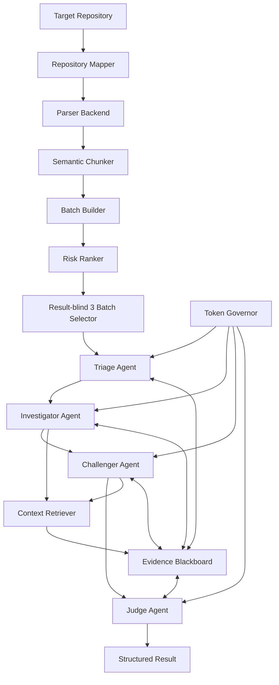

# REFINE-SAST Stage 1 설계

## 1. 목표

REFINE-SAST는 Raspberry Pi Userland 전체를 LLM에 입력하지 않는다. 결정론적 도구가 저장소를 함수·심볼 단위로 인덱싱하고, 위험 가설을 검증하는 데 필요한 최소 코드만 Agent에 제공한다.

핵심 문장:

> 기존 RAG가 관련 있어 보이는 코드를 검색한다면, REFINE-SAST는 취약점 증명에서 아직 확인되지 않은 조건을 해결할 코드만 검색한다.

이 설계는 다음 과제 조건을 동시에 만족해야 한다.

1. 대형 저장소 코드 분할
2. 분할 Batch 중 3개 실제 분석
3. 역할이 분리된 Multi-Agent
4. Agent별 실제 구현과 실행 흔적
5. 토큰 절약 설계 적용 및 정량 측정

## 2. 비목표

- TargetCode 자동 수정
- 모든 CWE를 완전하게 탐지
- LLM 판정을 ground truth로 간주
- 전체 저장소의 완전한 빌드 복구
- 동적 분석이나 exploit 생성
- Stage 1에서 애플리케이션 구현 또는 실제 LLM 호출

## 3. 설계 원칙

1. **Target immutability**: `target/userland`는 읽기 전용 입력이다.
2. **Deterministic before probabilistic**: 파일 탐색, 파싱, 해시, 토큰 계산, 증거 위치 검증은 일반 코드가 수행한다.
3. **Semantic chunking**: 고정 줄 수가 아니라 함수·타입·매크로 경계를 사용한다.
4. **Progressive disclosure**: 처음에는 Security Sketch만 제공하고 미확인 proof obligation에 필요한 원문만 추가한다.
5. **Proof, not prose**: Agent 간 장문 대화 대신 claim, evidence reference, contradiction, context request를 사용한다.
6. **No forced verdict**: 증거가 부족하면 `INCONCLUSIVE`다.
7. **Reproducibility**: 입력 커밋, parser 버전, prompt 버전, 모델, 토큰, 해시를 기록한다.
8. **Result-blind selection**: 세 Batch는 LLM 결과를 보기 전에 결정론적 규칙으로 선정한다.

## 4. 전체 구조



## 5. 권장 프로젝트 구조

```text
src/
  cli.py
  config.py
  repository/
    scanner.py
    parser.py
    chunker.py
    batch_builder.py
    risk_ranker.py
  agents/
    orchestrator.py
    cartographer.py
    triage.py
    investigator.py
    challenger.py
    judge.py
  context/
    evidence_board.py
    retriever.py
    token_governor.py
  llm/
    provider.py
    mock_provider.py
    usage_tracker.py
  reporting/
    report_builder.py
prompts/
schemas/
config/
tests/
artifacts/
  inventory/
  chunks/
  batches/
  runs/
  reports/
```

Stage 2 구현 언어는 Python 3.12로 고정한다. 현재 번들 Python과 `pydantic`을 사용할 수 있다. 외부 LLM SDK와 실제 모델 연결은 Stage 4까지 넣지 않는다.

## 6. 파서와 코드 분할

### 6.1 Parser Backend

파서는 교체 가능한 인터페이스로 둔다.

1. **Primary: Tree-sitter C/C++**
   - 완전한 cross compile 환경 없이도 오류 허용 구문 트리를 만든다.
   - 함수, 선언, 호출, 제어문, 주석 범위를 얻는다.
2. **Optional enrichment: Clang 22 AST**
   - 필요한 include와 define을 구성할 수 있는 파일에만 사용한다.
   - 타입 해석, 매크로 확장, 정확한 호출 target을 보강한다.
3. **Fallback: brace-aware lexical extractor**
   - 파서 실패 파일도 누락하지 않고 `parse_quality=degraded`로 표시한다.

Tree-sitter 관련 패키지는 현재 설치돼 있지 않으므로 Stage 2 시작 시 설치 승인이 필요할 수 있다. 패키지를 추가할 수 없으면 Clang+fallback 경로로 진행한다.

### 6.2 File Inventory

각 파일은 다음 필드를 가진다.

```json
{
  "path": "containers/rtsp/rtsp_reader.c",
  "language": "c",
  "bytes": 0,
  "physical_lines": 0,
  "content_hash": "sha256:...",
  "scope": "primary-source",
  "build_memberships": [],
  "parse_quality": "full|partial|degraded|skipped"
}
```

### 6.3 Semantic Chunk

기본 Chunk는 함수 하나다.

```json
{
  "chunk_id": "CHK-...",
  "path": "containers/rtsp/rtsp_reader.c",
  "symbol": "rtsp_read_header",
  "kind": "function",
  "start_line": 1,
  "end_line": 1,
  "content_hash": "sha256:...",
  "estimated_tokens": 0,
  "calls": [],
  "referenced_types": [],
  "referenced_macros": [],
  "risk_tags": [],
  "parse_quality": "full"
}
```

보조 Chunk 종류는 `type`, `macro`, `global`, `inline-function`, `file-prologue`다. 헤더 전체를 반복 입력하지 않고 필요한 보조 Chunk ID만 참조한다.

### 6.4 대형 함수 처리

초기 목표는 원문 기준 Chunk당 최대 1,800 토큰이다.

- 1,800 토큰 이하면 함수 전체 유지
- 초과하면 최상위 compound statement 또는 control-flow region으로 분할
- 모든 하위 Chunk에 함수 시그니처, 로컬 변수 선언, 참조하는 타입/매크로 ID를 공통 메타데이터로 부착
- 원본 파일·줄 범위를 보존
- 문자열 리터럴, 주석, 전처리 블록 내부에서 분할 금지
- `parse_quality=degraded`인 함수는 자동 세 Batch 선정을 제한하고 수동 검토 표시

고정 줄 수 분할은 fallback의 최후 수단이며 기본 경로로 사용하지 않는다.

## 7. Batch 구성

Batch는 하나의 focal chunk와 그 가설을 판정하는 데 필요한 근접 문맥으로 구성한다.

```json
{
  "batch_id": "BAT-...",
  "focus_chunk_id": "CHK-...",
  "member_chunk_ids": [],
  "dependency_refs": [],
  "risk_tags": [],
  "risk_score": 0.0,
  "source_token_estimate": 0,
  "selection_reasons": [],
  "selection_status": "candidate|selected|not-selected"
}
```

### 7.1 초기 Batch packing

1. focal 함수 원문
2. 직접 호출자/피호출자의 Security Sketch
3. 위험 호출의 인자에 관여하는 타입·매크로
4. 동일 파일의 관련 guard
5. 원문은 초기 최대 6,000 토큰
6. 중복 코드는 Evidence ID로 공유하고 원문 재전송 금지

Batch가 6,000 토큰을 넘으면 위험 call과 데이터 의존성에 가까운 Chunk부터 남긴다. 제외된 Chunk는 `dependency_refs`에 보존하여 Agent가 명시적으로 요청할 수 있게 한다.

## 8. 위험 순위와 세 Batch 선정

### 8.1 사전 위험 점수

점수는 LLM 결과 없이 계산한다. 초기 구성은 다음 요인의 정규화 합이다.

- 입력 경계: 네트워크, 파일, CLI, 펌웨어 IPC
- 위험 sink: raw memory write, command, format, path, allocation lifetime
- source-sink 근접성
- 호출/분기/포인터 복잡도
- 길이·반환값 guard의 부재 가능성
- primary build scope 여부
- parser 신뢰도

정규식 출현 횟수만으로 점수를 확정하지 않는다. 동일 함수 내의 호출 인자와 guard를 파서로 확인한다.

### 8.2 결과 독립적 선택

모든 Batch를 위험 점수로 내림차순 정렬한 뒤 greedy diversity 선택을 수행한다.

```text
selection_score = normalized_risk - 0.25 * max_similarity_to_selected
```

유사도에는 같은 focal 파일, 같은 최상위 디렉터리, 같은 위험 태그, 겹치는 Chunk 비율을 사용한다. 다음 제약을 적용한다.

- 정확히 3개 선택
- 가능한 경우 서로 다른 focal 파일
- 가능한 경우 2개 이상의 최상위 디렉터리
- 가능한 경우 2개 이상의 위험 태그
- Test/example/bundled source는 focal Batch 금지
- LLM 분석 결과를 보기 전에 selection manifest 고정

세 결과는 `CONFIRMED`, `REJECTED`, `INCONCLUSIVE` 중 무엇이든 가능하다. 세 취약점을 강제로 만드는 것이 목표가 아니다.

## 9. Security Sketch와 proof obligation

Security Sketch는 원문 대신 Triage에 우선 전달하는 구조화 정보다.

```json
{
  "symbol": "run_cmd",
  "location": "host_applications/linux/apps/dtoverlay/utils.c:...",
  "parameters": [],
  "calls": [],
  "reads": [],
  "writes": [],
  "guards": [],
  "risk_tags": [],
  "evidence_refs": []
}
```

CWE 템플릿은 증명해야 할 조건을 정의한다. 예를 들어 메모리 경계 후보는 다음을 확인한다.

1. 공격자 또는 외부 경계가 값을 통제하는가?
2. 값 또는 그로부터 계산된 길이가 memory sink에 도달하는가?
3. 목적지 capacity를 알 수 있는가?
4. 경로상 유효한 bound check가 없는가?
5. 빌드 가능한 경로에서 호출 가능한가?

각 항목 상태는 `SUPPORTED`, `REFUTED`, `UNKNOWN`만 허용하며 Evidence ID가 없는 `SUPPORTED`는 schema validation에서 거부한다.

## 10. Multi-Agent 역할

### 10.1 Orchestrator

- 상태 머신 실행
- Agent별 독립 context 생성
- 실패·재시도·중단 처리
- Agent를 대신해 보안 판단하지 않음

### 10.2 Cartographer Agent

- 결정론적 도구를 호출해 Repository Map과 Security Sketch 생성
- LLM을 기본 사용하지 않음
- 산출물: file/chunk/batch manifest

### 10.3 Triage Agent

- 입력: Security Sketch, 위험 태그, 최소 CWE 설명
- 모델: 저비용 모델, 낮은 reasoning effort
- 출력: `PRIORITIZE`, `DEFER`, `NEED_CONTEXT`
- 권한: CWE 가설과 proof obligation 생성
- 금지: `SAFE` 또는 최종 취약 판정

### 10.4 Investigator Agent

- 입력: 선택된 Batch, proof obligation, Evidence Blackboard
- 모델: 고성능 모델, high reasoning effort
- 역할: 취약 주장을 지지하는 정확한 source-sink-guard 경로 구성
- 필요한 경우 허용된 `REQUEST_CONTEXT`만 생성

### 10.5 Challenger Agent

- Investigator와 독립된 prompt/context 사용
- 모델: 고성능 모델, high reasoning effort
- 역할: sanitizer, bound check, unreachable branch, build exclusion, 안전 wrapper 등 반례 탐색
- 긴 반론 대신 `CONTRADICTION` 또는 `REQUEST_CONTEXT` 출력

### 10.6 Judge Agent

- Investigator의 숨은 추론이나 자유형식 대화를 받지 않음
- 원문 Evidence, Claim, Contradiction, proof obligation만 받음
- 모델: 고성능 모델, xhigh reasoning effort
- 모든 필수 obligation이 지원되고 미해결 반례가 없을 때만 `CONFIRMED`
- 증거 부족은 `INCONCLUSIVE`, 필수 조건 반증은 `REJECTED`

## 11. Evidence Blackboard

Agent 간 메시지는 Stage 3의 명시적 과제 지시에 따라 다음 네 종류로 제한한다.

- `FINDING`
- `EVIDENCE`
- `CONTRADICTION`
- `REQUEST_CONTEXT`

허용 Context Request:

- `GET_FUNCTION`
- `GET_CALLERS`
- `GET_CALLEES`
- `GET_TYPE_DEFINITION`
- `GET_MACRO`
- `GET_GUARDS`
- `GET_DATAFLOW_SLICE`
- `GET_GLOBAL_WRITES`
- `GET_BUILD_CONDITION`

Evidence Blackboard에는 원본 경로, 시작/끝 줄과 byte, 내용 해시를 보관한다. 원문은 Context Retriever가 요청 Agent에만 일시적으로 제공하며 Agent 간 메시지나 이벤트 로그에는 넣지 않는다. 최종 결과 작성 전에 해당 범위와 해시를 TargetCode에서 다시 검증한다.

## 12. Token Governor

### 12.1 초기 예산

| 단계 | 입력 상한 목표 | 출력 상한 목표 | 비고 |
|---|---:|---:|---|
| Triage | 2,000 | 400 | Sketch 중심 |
| Investigator 최초 | 6,000 | 1,200 | focal 원문+근접 문맥 |
| Context 확장 | 회당 2,500 | 300 | 최대 2회 |
| Challenger | 4,000 | 800 | claim과 반증 문맥 |
| Judge | 3,500 | 800 | 최소 증거 패킷 |

상한은 Stage 2 token estimator와 Stage 4 실제 모델 tokenizer로 교정한다. 상한 초과 시 코드 가운데를 자르지 않고 낮은 우선 dependency를 Evidence reference로 치환한다.

### 12.2 Context 요청 우선순위

```text
request_value = severity * hypothesis_probability * expected_uncertainty_reduction
                / max(estimated_tokens, 1)
```

예산 소진 시 `INCONCLUSIVE`로 끝내며 안전으로 간주하지 않는다.

### 12.3 실제 토큰 절약

- LLM 이전 scope filtering과 위험 후보 생성
- 함수·심볼 단위 semantic chunking
- 세 Batch만 실제 분석
- content hash 기반 결과 캐시
- Evidence ID로 Agent 간 코드 중복 방지
- 미확인 obligation에만 점진적 문맥 확장
- JSON Structured Output과 출력 길이 제한
- 동일 커밋·prompt·model 조합 재실행 방지

### 12.4 비용 절약과 구분

- 저비용/고성능 모델 라우팅: 주로 비용 절감
- Provider prompt caching: 주로 청구 비용·지연 절감
- Batch API: 주로 비용·처리량 개선
- 위 세 항목을 실제 입력 토큰 감소로 보고하지 않는다.

## 13. 측정과 비교

### 13.1 Baseline

다음 두 baseline을 생성한다.

1. **Repository baseline**: 모든 primary source를 단일/연속 prompt로 보낸다고 가정한 토큰 합
2. **All-batch baseline**: 생성한 모든 Batch를 고성능 모델로 한 번씩 분석한다고 가정한 토큰 합

### 13.2 실제 지표

- 총 input/output/reasoning/cached token
- Agent·모델·Batch별 토큰
- 고성능 모델 승격률
- cache hit rate
- context expansion 횟수
- Evidence Density
- Context Waste Ratio
- Refinement Efficiency
- Proof Completeness
- 예상 비용과 wall-clock time

```text
input_token_reduction = 1 - actual_input_tokens / all_batch_baseline_tokens
strong_model_avoidance = 1 - strong_model_batches / all_candidate_batches
proof_completeness = supported_required_obligations / required_obligations
```

## 14. 실행 추적과 산출물

모든 실행은 다음 경로에 기록한다.

```text
artifacts/inventory/repository.json
artifacts/chunks/chunks.jsonl
artifacts/batches/batches.jsonl
artifacts/batches/selection.json
artifacts/runs/<run-id>/events.jsonl
artifacts/runs/<run-id>/token-ledger.json
artifacts/runs/<run-id>/batch-<id>-result.json
artifacts/reports/final-report.md
```

`events.jsonl`에는 timestamp, agent, input evidence IDs, output type, model, prompt version, token usage, retry, error를 기록한다. API key와 전체 환경변수는 절대 기록하지 않는다.

## 15. 테스트 전략

### Unit

- C 함수와 전처리 블록 경계
- 문자열/주석 내부 중괄호 처리
- oversized 함수의 의미 단위 분할
- Batch token budget 불변식
- 동일 입력의 안정적 content hash와 ID
- scope 분류와 result-blind selection
- Evidence 위치·해시 재검증
- Token Governor 예산 초과와 `INCONCLUSIVE`

### Integration

- 작은 fixture 저장소를 end-to-end 처리
- Mock Provider로 네 Agent가 각자 최소 한 번 실행됨을 검증
- 반증 존재/부재/문맥 부족 세 시나리오
- 재실행 시 cache hit와 LLM 호출 0 확인

### Target smoke

- TargetCode를 수정하지 않고 inventory/chunk/batch 생성
- 세 Batch selection manifest 고정
- 실제 LLM 연결 전 deterministic artifacts 재현성 확인

## 16. Stage 2 결정 사항

Stage 2에서는 다음만 구현한다.

1. Repository Scanner
2. Parser Backend와 Semantic Chunker
3. Batch Builder
4. Risk Ranker
5. Token Estimator
6. Content Hash Cache
7. 세 Batch의 결과 독립적 selector
8. Unit test와 deterministic artifacts

Agent와 실제 LLM 호출은 Stage 2 범위가 아니다. 다만 Stage 3가 사용할 schema와 디렉터리는 만든다.

## 17. Stage 4 실제 Provider 기반

### 17.1 공식 API 계약

선택적 OpenAI Provider는 Responses API의 Pydantic Structured Outputs 계약을 사용한다. 모델 이름, reasoning effort, usage 필드는 설정 파일에서 관리하며 최종 제출 실행 경로는 Gemini Provider를 사용한다.

### 17.2 Provider 공통 계약

`LLMProvider` Protocol은 Mock과 실제 Provider에 아래 네 메서드를 동일하게 요구한다.

```text
triage(context) -> ProviderResponse[TriageOutput]
investigate(context, obligations) -> ProviderResponse[InvestigatorOutput]
challenge(context, obligations, finding_id) -> ProviderResponse[ChallengerOutput]
judge(context, obligations) -> ProviderResponse[JudgeOutput]
```

응답은 동일한 Stage 3 Pydantic schema와 정규화된 token usage를 사용한다. 실제 Provider는 API key와 SDK를 호출 직전에만 확인하며, 테스트에서는 동일한 `responses.parse` 계약을 가진 주입형 client를 사용한다.

### 17.3 환경별 모델 라우팅

`config/model-routing.json`에는 `development`, `production` profile이 있다. profile은 실행 시 명시적으로 선택할 수 있고 모델은 소스 코드에 하드코딩하지 않는다.

| Agent | Model | Reasoning | 목적 |
|---|---|---|---|
| Triage | `gpt-5.6-luna` | `low` | 값싼 초기 선별 |
| Investigator | `gpt-5.6-sol` | `high` | 경로·증명 조건 분석 |
| Challenger | `gpt-5.6-sol` | `high` | 반증 탐색 |
| Judge | `gpt-5.6-sol` | `xhigh` | 최종 검증 |

### 17.4 오류 및 재시도

| 오류 | 재시도 | 최종 상태 |
|---|---:|---|
| timeout / connection / rate limit / server | 최대 3회 시도 | `INCONCLUSIVE` |
| schema validation | 최대 3회 시도 | `INCONCLUSIVE` |
| authentication / permission / bad request | 없음 | `INCONCLUSIVE` |
| 분류 불가 오류 | 없음 | `INCONCLUSIVE` |

SDK 내장 retry는 0으로 두어 이 정책과 중복되지 않게 한다. `Retry-After`가 있으면 제한 범위에서 우선 사용하고, 없으면 jitter가 포함된 bounded exponential backoff를 사용한다. 최종 예외에는 provider 원문 오류를 연결하지 않고 안전한 오류 코드와 시도 횟수만 남긴다.

### 17.5 Secret 보호

- `OPENAI_API_KEY`만 호출 직전에 읽는다.
- key 존재 여부만 boolean으로 검사한다.
- 설정, event, ledger, artifact, 예외에 key 값이나 전체 환경변수를 기록하지 않는다.
- SDK가 없거나 key가 없으면 client를 생성하지 않고 `PROVIDER_UNAVAILABLE → INCONCLUSIVE`로 종료한다.

### 17.6 Usage Tracker

모든 실제 Provider 호출은 `artifacts/runs/<run-id>/token-ledger.json`에 provider, model, agent, batch, input/output/cached/reasoning token, retry, latency, prompt version, schema version, status, error code만 기록한다. 원문 코드, prompt 본문, 요청 payload, 비밀정보는 기록하지 않는다. Stage 4 예제 ledger는 Mock usage로만 생성되며 실제 분석 결과가 아니다.

### 17.7 Stage 4 경계

이번 단계는 연결·라우팅·보호·계측 기반만 검증한다. 고정된 3개 Batch에 대한 실제 호출과 보안 판정은 하지 않는다. Stage 5에서 Evidence Blackboard가 검증한 일시적 source packet을 Provider 입력에 연결하고, 호출 승인을 받은 뒤 실제 분석을 수행한다.

## 18. Stage 5 Local LLM Provider 설계

### 18.1 기본 실행 경계

기본 routing profile은 `local-balanced`이고 Provider는 `ollama-local`이다. OpenAI Provider는 `development` 또는 `production` profile을 명시적으로 선택할 때만 생성된다. Local 경로는 `OPENAI_API_KEY`를 읽거나 OpenAI client를 초기화하지 않는다.

### 18.2 역할별 모델

| Agent | Model | Context | Thinking | Fallback |
|---|---|---:|---|---|
| Triage | `qwen2.5-coder:1.5b` | 4,096 | off | `qwen2.5-coder:7b` |
| Investigator | `qwen2.5-coder:7b` | 12,288 | off | `qwen2.5-coder:1.5b` |
| Challenger | `qwen3:4b-thinking` | 8,192 | on | `qwen3:8b` |
| Judge | `qwen3:8b` | 8,192 | on | `qwen3:4b-thinking` |

모델 이름과 capability는 설정 파일에서만 관리한다. Local Provider는 capability registry에 없는 모델이나 Structured Output을 지원하지 않는 모델을 시작 전에 거부한다.

### 18.3 검증된 일시적 문맥

`VerifiedLocalContextSource`는 Evidence Blackboard의 ID를 조회하고 Context Retriever가 Chunk 경로·줄·byte·content hash를 다시 확인한 뒤 해당 범위만 일시적으로 materialize한다. 원문은 Ollama 요청에만 존재하며 event log, token ledger, Agent message, cache value에 기록하지 않는다.

### 18.4 Structured Output과 오류 정책

Agent 출력 Pydantic JSON Schema를 Ollama chat 요청의 `format`으로 전달하고 `message.content`를 동일 모델로 재검증한다. Schema 실패는 정확히 한 번만 repair 재시도하고 다른 모델로 결과를 바꾸지 않은 채 `INCONCLUSIVE`로 종료한다. Timeout·connection·model availability 실패는 제한된 재시도 후 설정된 fallback 모델을 한 번 사용하며, 모든 시도는 source 없이 ledger에 기록한다.

### 18.5 사용량과 cache

Ollama의 `prompt_eval_count`와 `eval_count`를 input/output token으로 기록한다. Ollama가 별도 cached/reasoning token count를 제공하지 않는 경우 값은 0이며 `*_reported=false`를 함께 기록해 추정치와 실제 측정값을 혼동하지 않는다. Cache key는 provider, runtime model digest, prompt version, schema version, 전체 일시적 context hash로 구성한다. Cache value에는 구조화된 출력과 버전 메타데이터만 저장한다.

### 18.6 Stage-barrier 실행

고정된 3개 Batch를 `Triage 3개 → Investigator 3개 → Challenger 3개 → Judge 3개` 순서로 실행한다. Batch별 논리 의존성은 유지하면서 같은 역할 모델의 재로딩을 줄인다. Provider 실패나 예산 소진으로 한 Batch가 `INCONCLUSIVE`가 되면 해당 Batch의 이후 job은 안전하게 생략되고 다른 Batch는 계속 진행한다. 각 역할 barrier 종료 시 transport unload callback을 연결할 수 있다.

Stage 5에서는 fake transport만 사용하며 실제 Ollama 연결, 모델 다운로드, 실제 보안 판정은 수행하지 않는다.

## 19. 저메모리 Local profile

`local-balanced`를 보존하면서 명시적으로 선택하는 `local-constrained` profile을 추가한다. 이 profile은 자동 fallback으로 더 큰 모델이 로딩되는 것을 막고, 각 요청 후 `keep_alive=0`으로 모델을 즉시 언로드한다.

| Agent | Model | Context | Thinking | 자동 fallback |
|---|---|---:|---|---|
| Triage | `qwen2.5-coder:1.5b` | 4,096 | off | 없음 |
| Investigator | `qwen2.5-coder:7b` | 8,192 | off | 없음 |
| Challenger | `qwen3:4b-thinking` | 4,096 | off 요청(모델이 강제 thinking) | 없음 |
| Judge | `qwen3:4b-thinking` | 4,096 | off 요청(모델이 강제 thinking) | 없음 |

Judge Agent의 최종 verdict는 모델의 자유 판단에 맡기지 않는다. 기존 Deterministic Safety Kernel을 유지하여 필수 proof obligation 중 하나라도 `REFUTED`이면 `REJECTED`, 모두 `SUPPORTED`이면 `CONFIRMED`, 하나라도 `UNKNOWN`이거나 예산이 소진되면 `INCONCLUSIVE`만 허용한다. Provider가 다른 verdict를 반환하면 실행을 거부한다.

2026-08-12 사전 벤치마크에서는 네 역할 모델이 모두 로딩됐지만 Investigator, Challenger, Judge 실행 중 가용 RAM이 2GB 아래로 내려갔다. 따라서 `local-constrained`도 현재 PC 상태에서는 실제 Batch 분석 승인을 받지 못한다.

Challenger와 Judge에 `think=false`를 전달한 재시험에서는 가용 RAM이 각각 최저 2.106GB와 2.291GB로 하한을 지켰지만, 응답의 thinking 필드는 계속 생성됐다. 두 역할 모두 다시 800 output token을 소진하고 최종 JSON Schema 검증에 실패하여 토큰 절감은 0%였다. 설치된 `qwen3:4b-thinking` digest는 Qwen3-4B-Thinking-2507 계열이며 이 모델은 thinking-only 모델이다. 따라서 모델과 context를 유지한다는 조건에서는 thinking을 실제로 비활성화할 수 없다. 설정은 사용자의 비활성화 의도를 보존하지만 이 profile은 실제 분석에 사용하지 않고 `INCONCLUSIVE` 사전 차단 상태로 유지한다.
## Gemini free-tier provider extension (2026-08-12)

The provider boundary now also supports `gemini-generate-content` without changing
the Triage, Investigator, Challenger, Judge, Orchestrator, Evidence Blackboard,
Context Retriever, Token Governor, or deterministic Judge safety kernel.

- `GeminiTransport` owns only HTTP authentication and sanitized transport errors.
- `GeminiProvider` owns role prompts, Pydantic JSON Schema, response validation,
  usage normalization, bounded retry, `INCONCLUSIVE`, and content-hash caching.
- The API key is read lazily from `GEMINI_API_KEY` only immediately before a live
  transport is created. The key is never included in a URL, request JSON, ledger,
  cache, artifact, or exception.
- Source is materialized only through the existing verified context source. Cache
  and token ledger contain hashes, IDs, model metadata, and typed outputs only.
- Gemini usage maps `promptTokenCount`, `candidatesTokenCount`,
  `cachedContentTokenCount`, and `thoughtsTokenCount` into the existing normalized
  ledger fields.
- Role reasoning routes are applied as Gemini `thinkingConfig.thinkingLevel`.
  `xhigh` and `max` are capped at Gemini's supported `high` level.
- `gemini-free` is an opt-in routing profile. The default `local-balanced` profile
  remains unchanged, and no provider is initialized unless its profile is selected.
- Offline verification uses an injected fake transport. A live smoke test and the
  three selected Batch analyses remain explicit approval gates.
