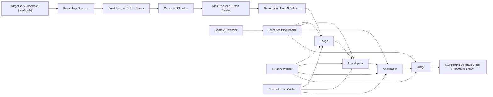

# AI 기반 Multi-Agent SAST 설계 및 구현 보고서

## 1. 제출 정보

- 과제: AI로 만든 SAST
- 작성자: 이재우
- GitHub 저장소: https://github.com/mps0927/AI_SAST
- TargetCode: <https://github.com/raspberrypi/userland>
- 분석 commit: `a54a0dbb2b8dcf9bafdddfc9a9374fb51d97e976`
- 최종 분석 Run ID: `gemini-recovery-3batch-20260812T175919Z`
- 보고서 형식: `report.md`

## 2. 과제 목표와 접근 방법

대형 C/C++ 저장소 전체를 LLM에 그대로 넣는 방식은 context 한도, 비용,
근거 추적, 재현성 측면에서 실용적이지 않다. REFINE-SAST는 다음 질문을
해결하는 방향으로 설계했다.

1. 거대한 저장소를 어떻게 의미 단위로 나눌 것인가?
2. 여러 Agent가 같은 코드를 반복 전송하지 않고 어떻게 협업할 것인가?
3. LLM이 그럴듯하지만 근거 없는 결론을 내리는 것을 어떻게 막을 것인가?
4. 토큰을 줄이면서도 보안 판단에 필요한 문맥을 어떻게 유지할 것인가?

핵심 답은 **함수 중심 분할 + 결과 비의존 Batch 선정 + Evidence Blackboard
+ proof obligation + 결정론적 Judge**의 결합이다. LLM은 가설과 증거
해석을 담당하고, 프로그램은 ID·범위·hash·예산·최종 판정 규칙을 통제한다.

## 3. 과제 필수 요구사항 충족 요약

| 필수 요구사항 | 구현 | 실제 검증 |
|---|---|---|
| 대형 저장소 코드 분할 | 오류 허용 Parser, 함수 중심 Semantic Chunker, 대형 함수 분할 | 830개 파일, 654개 C/C++ 파일, 4,659개 Chunk |
| 선정 Batch 분석 | 결과 확인 전 위험도와 다양성으로 분석 대상 선정 | Selection hash 고정, 세 Batch 결과 생성 |
| Multi-Agent 구조 | Triage, Investigator, Challenger, Judge | 각 Batch에서 네 Agent 1회씩, 총 12회 |
| Agent별 구체 역할 및 구현 | 별도 클래스·prompt·Pydantic schema·context·종료 조건 | events.jsonl에 순서와 메시지 기록 |
| 토큰 절약 설계 및 적용 | 최소 Chunk, Evidence ID, Token Governor, Cache, source-free Judge | 전체 저장소 source baseline 대비 98.8314% 절감 |

요구사항별 세부 추적은 [`docs/acceptance-matrix.md`](docs/acceptance-matrix.md)에
정리했다.

## 4. 전체 구조



### 4.1 전처리 계층

- `RepositoryScanner`: Git 추적 파일, 언어, 디렉터리 scope, build membership,
  content hash를 수집한다.
- `TreeSitterBackend`: C/C++ Tree-sitter parsing을 우선 사용하고 오류가 많은
  파일은 brace-aware fallback으로 함수 후보를 복구한다.
- `SemanticChunker`: 함수를 기본 단위로 유지하고 1,800 source-token을 넘는
  대형 함수만 안전한 문장 경계에서 `function-part`로 분할한다.
- `RiskRanker`: LLM 결과를 보지 않고 위험 API, 경계 복잡도, parse 품질,
  파일 scope를 이용해 위험도를 계산한다.
- `BatchBuilder`: 관련 함수와 dependency reference를 6,000 source-token
  예산 안에 묶는다.

### 4.2 분석 계층

- `Orchestrator`: 네 역할의 순서, 상태 전이, fail-safe 실행을 관리한다.
- `Evidence Blackboard`: 검증된 Evidence만 등록하고 Agent가 ID로 공유하게
  한다.
- `Context Retriever`: 필요한 Chunk 범위만 일시적으로 materialize한다.
- `Token Governor`: 역할별 입력·출력, Batch 전체, 추가 문맥 요청 횟수를
  제한한다.
- `Content Hash Cache`: provider, model version, prompt version, schema
  version, context hash가 같으면 모델 호출을 생략한다.
- `Usage Tracker`: token, retry, latency, version, 상태만 기록하고 코드와
  prompt 본문은 저장하지 않는다.

## 5. 코드 분할 처리

### 5.1 경계 보존

단순히 줄 수로 자르면 문자열 내부의 중괄호, 주석, 전처리기 조건부 블록,
함수 signature가 깨질 수 있다. Parser가 제공하는 함수 범위를 우선 사용하고,
fallback parser도 문자열·문자 literal·주석 상태를 추적한다. 대형 함수는
signature와 context header를 유지한 채 statement 경계에서 나눈다.

각 Chunk에는 다음을 포함한다.

- 안정적 Chunk ID
- TargetCode 상대 경로
- 시작·종료 행 및 byte 범위
- source content hash
- 함수 scope와 symbol
- 위험 API/risk tag
- 결정론적 lexical token 추정치
- parse quality

### 5.2 실제 분할 통계

| 항목 | 결과 |
|---|---:|
| Git 추적 파일 | 830 |
| 분석된 C/C++ 파일 | 654 |
| 함수 Chunk | 4,641 |
| 대형 함수 부분 Chunk | 18 |
| 전체 Chunk | 4,659 |
| Batch 후보 | 520 |
| 최대 일반 Chunk | 1,798 source tokens |
| 최대 Batch | 5,987 source tokens |
| Token budget 예외 | 0 |

Parser cache 재실행에서는 654개 항목이 모두 hit했고, Chunk·Batch artifact
fingerprint도 재현됐다.

분석 결과에 따른 임의 선정을 피하기 위해 첫 LLM 호출 전에
`result-blind-diversity-v1` 규칙으로 분석 Batch를 고정했다. 520개 후보에
위험도, 파일·디렉터리·risk tag 다양성, 후보 간 유사도를 반영했으며 selection
hash는 `sha256:8c89de6d61f5338d11066821fa374432dc95d23bf8a1ad47ffc11b137f087a50`이다.

| 순서 | Batch | Focus | 위험도 | 주요 tag | source tokens |
|---:|---|---|---:|---|---:|
| 1 | `BAT-A8363625BEDB28094BEF` | `simple_reader.c::simple_read_header` | 72 | raw-memory, unbounded-string | 1,359 |
| 2 | `BAT-B3DA91B545FB3EF2B360` | `RaspiVid.c::open_filename` | 68 | allocation, file-path, network, unbounded-string | 968 |
| 3 | `BAT-7E6A7DCB5C894DC0A989` | `net_sockets_common.c::vc_container_net_open` | 71 | allocation, network, raw-memory | 1,386 |

## 6. Multi-Agent 설계와 Skill 작성 주안점

이 구현에서 Agent의 “skill”은 역할 prompt, 허용 입력, 구조형 출력 schema,
권한 범위, 종료 조건의 묶음이다. 자유 대화형 Agent가 아니라 서로 다른
책임을 가진 검증 가능한 프로그램 구성요소로 구현했다.

| Agent | 역할 | 입력 | 출력/종료 조건 |
|---|---|---|---|
| Triage | 위험 후보 우선순위와 단일 가설 생성 | Security Sketch, risk tag, Evidence ID | FINDING과 필수 proof obligation 생성 후 종료. 최종 판정 권한 없음 |
| Investigator | source/sink/guard와 proof 검증 | Finding, proof packet, 검증 Evidence | EVIDENCE 또는 REQUEST_CONTEXT. 모든 proof 갱신 또는 요청 한도에서 종료 |
| Challenger | 독립적으로 반례·오탐 조건 탐색 | Finding, Investigator Evidence 요약, proof table | CONTRADICTION 또는 REQUEST_CONTEXT 후 한 번의 반례 탐색으로 종료 |
| Judge | proof 기반 최종 판정 제안 | Finding, contradiction, 검증 proof, 예산 상태 | 한 번의 verdict 후 종료. 프로그램의 결정론적 규칙이 최종 강제 |

Skill 작성에서 다음을 우선했다.

1. 역할 간 권한 분리: 앞 Agent가 final verdict를 내릴 수 없다.
2. hidden reasoning 비공유: Agent는 다른 Agent의 내부 추론을 받지 않는다.
3. 구조형 출력: Pydantic과 Gemini Wire Schema로 허용 필드만 받는다.
4. 근거 강제: SUPPORTED에는 등록된 Evidence ID가 필요하다.
5. 명시적 종료: 모든 Agent가 한정된 호출과 문맥 요청 안에서 끝난다.
6. 실패 폐쇄: 미확인 proof가 있으면 SAFE가 아니라 INCONCLUSIVE다.

## 7. Agent Prompt

실행에 사용한 전체 prompt는 [`prompts/`](prompts/)에 있고 각 파일 hash는
token ledger의 prompt version으로 추적된다. 핵심 지시는 다음과 같다.

### Triage

> Security Sketch, risk tag, stable Evidence ID만 받고 하나의 가설과 명시적
> proof obligation을 만든다. SAFE/CONFIRMED/REJECTED를 출력하지 않는다.

### Investigator

> Evidence 기반 source/sink/guard 논증만 만들며 부족한 코드는
> REQUEST_CONTEXT로 요청한다. Agent 메시지에 source 원문을 복사하지 않고,
> 등록 Evidence 없이는 SUPPORTED를 만들지 않는다.

### Challenger

> sanitizer, bound check, unreachable path, build exclusion, safe wrapper 등
> 반례를 독립적으로 찾는다. Investigator의 hidden reasoning을 상속하지 않고
> final verdict를 내리지 않는다.

### Judge

> 필수 proof가 모두 SUPPORTED이고 REFUTED가 없을 때만 CONFIRMED, 필수 proof가
> REFUTED면 REJECTED, 하나라도 UNKNOWN이거나 예산이 소진되면 INCONCLUSIVE를
> 반환한다.

## 8. Evidence Blackboard와 신뢰성 설계

Agent 간 허용 메시지는 `FINDING`, `EVIDENCE`, `REQUEST_CONTEXT`,
`CONTRADICTION` 네 종류뿐이다. 자유 형식 source 전달은 금지했다.

Evidence를 등록·사용하기 직전에 다음을 검증한다.

- TargetCode 내부의 정규화된 상대 경로인가?
- 시작·종료 행과 byte 범위가 유효한가?
- 현재 파일 byte 범위의 content hash가 등록 hash와 같은가?
- 참조 Chunk ID가 고정 artifact에 존재하는가?

하나라도 다르면 Evidence를 거부하고 관련 proof는 UNKNOWN을 유지한다.
로그에는 Evidence ID, 범위, hash, Agent, 상태 전이만 남고 코드 원문은 남지
않는다.

### 8.1 결정론적 Judge

LLM Judge의 verdict를 그대로 신뢰하지 않는다.

- required proof 중 REFUTED가 하나라도 있으면 `REJECTED`
- 모든 required proof가 SUPPORTED이면 `CONFIRMED`
- required proof 중 UNKNOWN이 있거나 Token Governor가 소진되면
  `INCONCLUSIVE`

LLM verdict가 이 규칙과 다르면 프로그램이 거부하거나 override한다. 이로써
환각이나 과도한 확신이 최종 안전 판정을 바꾸지 못한다.

## 9. 토큰 절약 설계와 도입 이유

단순히 저가 모델을 사용하는 것보다 **전송하지 않아도 되는 코드를 먼저
제거하는 것**이 가장 큰 절감 효과를 낸다고 생각하였다

| 설계 | 도입 이유 | 실제 적용 |
|---|---|---|
| 함수 중심 Chunk | 저장소 전체/파일 전체 전송 방지 | Triage에 focus 함수 중심 전달 |
| 위험도+다양성 Batch | 중요한 영역을 적은 수로 대표 | 520개 후보 중 3개 사전 고정 |
| 최소 문맥 검색 | 처음부터 모든 dependency 전달 방지 | Investigator 요청 시에만 검증·승인 |
| Evidence ID 공유 | Agent마다 source 원문 반복 방지 | Blackboard 메시지는 ID와 요약만 공유 |
| source-free Judge | 최종 판단에는 proof 상태가 핵심 | Judge에 코드 대신 proof table 전달 |
| Token Governor | runaway context/output 방지 | 역할별·Batch별 예산과 요청 횟수 제한 |
| Content Hash Cache | 동일 분석의 API 재호출 방지 | version+context hash cache key |
| 얕은 Wire Schema | JSON schema 자체의 입력 토큰 감소 | 의미 필드만 모델 생성 |
| 낮은 thinking | 구조형 역할에 불필요한 reasoning 제거 | 최종 실행 reasoning tokens 0 |

### 9.1 실제 토큰 결과

| 구분 | 값 |
|---|---:|
| API 호출 | 12 |
| 재시도 | 0 |
| Provider input tokens | 32,148 |
| Provider output tokens | 1,181 |
| Thinking/cached tokens | 0 / 0 |
| 실제 전송 source lexical estimate | 7,887 |
| 전체 저장소를 네 Agent에 보내는 source baseline | 2,750,876 |
| 선정 Batch 코드를 네 Agent에 반복하는 source baseline | 14,852 |
| 전체 저장소 baseline 절감률 | **98.8314%** |
| 선정 코드 baseline 절감률 | **46.896%** |

`Provider input tokens`에는 prompt와 JSON Schema가 포함된다. 반면 절감률은
코드 분할 효과를 보기 위한 source lexical estimate끼리 비교한 값이다. 두
지표를 같은 값처럼 해석하지 않았다. 최종 실행은 신규 context라 cache hit이
0이었으며, 절감은 분할·검색·Evidence 공유에서 발생했다.

## 10. 분석 결과

모든 Batch에서 `Triage → Investigator → Challenger → Judge`가 정확히 한 번씩
실행됐다. 총 logical/API calls는 12/12이고 retry는 0이다.

### 10.1 Batch A — 자동 CONFIRMED, 수동 검토는 오탐 가능성

- Batch: `BAT-A8363625BEDB28094BEF`
- Focus: `containers/simple/simple_reader.c::simple_read_header`
- 자동 가설: URI를 `sscanf("%s")`로 고정 배열에 읽는 buffer overflow
- Evidence: `EVD-D925C12B7E35BD982DDE`, 138~260행
- Proof: 2 required / 2 supported / 0 unknown
- Challenger: contradiction 없음
- Judge: `CONFIRMED`, `ALL_OBLIGATIONS_SUPPORTED`

**수동 검토:** 상위 `simple_read_line`은 입력 한 행을 `MAX_LINE_SIZE`로
제한하고 URI 배열은 `MAX_LINE_SIZE+1`이다. 따라서 현재 호출 경로에서 실제
overflow 가능성은 낮다. 이는 Challenger가 상위 입력 길이 불변식을 반례로
포착하지 못한 오탐 후보이며, 자동 CONFIRMED와 실제 취약점 확정을 구분해야
한다.

### 10.2 Batch B — 자동 CONFIRMED, 실제 검토 우선 후보

- Batch: `BAT-B3DA91B545FB3EF2B360`
- Focus: `host_applications/linux/apps/raspicam/RaspiVid.c::open_filename`
- 자동 가설: 외부 filename을 `asprintf`/`strftime` format으로 사용하는 문제
- Evidence: `EVD-72AD55E6591FE38453B9`, 968~1,139행
- Proof: 2 required / 2 supported / 0 unknown
- Challenger: contradiction 없음
- Judge: `CONFIRMED`, `ALL_REQUIRED_OBLIGATIONS_SUPPORTED`

**수동 검토:** Segment 또는 split 기능에서 사용자가 제어한 filename이 format
문자열로 사용된다. 코드가 단일 `%d`/`%u` 사용을 의도하지만 복수 지정자나
다른 형식이 포함되면 varargs 불일치에 따른 정의되지 않은 동작 가능성이
있다. 공격 조건은 관련 기능과 조작 가능한 출력 filename을 사용해야 한다.
세 후보 중 추가 보안 검토 우선순위가 가장 높다.

### 10.3 Batch C — 자동 INCONCLUSIVE, 수동으로는 위험이 낮아 보임

- Batch: `BAT-7E6A7DCB5C894DC0A989`
- Focus: `containers/net/net_sockets_common.c::vc_container_net_open`
- 자동 가설: `ai_addrlen` 길이의 `memcpy`가 `to_addr`를 넘을 가능성
- Evidence: `EVD-23C43AD15AADF6213B7C`, 135~276행
- Proof: 2 required / 0 supported / 2 unknown
- Context request: 타입 정의 문맥 1회 로컬 승인, 추가 LLM 호출 없음
- Challenger: contradiction 없음
- Judge: `INCONCLUSIVE`, `OBLIGATIONS_UNKNOWN`

**수동 검토:** 목적지는 `sockaddr_storage`를 포함한 union이고
`getaddrinfo`가 반환하는 지원 주소는 IPv4/IPv6 구조이므로 실제 overflow
가능성은 낮아 보인다. 그러나 분석 범위에서 모든 플랫폼의 `ai_addrlen`
상한을 형식적으로 증명하지 못했으므로 도구의 INCONCLUSIVE를 유지한다.

상세 결과는 [`artifacts/final-run/security-report.md`](artifacts/final-run/security-report.md)와
[`batch-results.json`](artifacts/final-run/batch-results.json)에 있다.

## 11. 차별점과 창의성

1. **Result-blind diversity selection**: 결과가 좋은 Batch를 나중에 고르는
   대신 첫 LLM 호출 전에 위험도와 다양성으로 3개를 고정한다.
2. **Evidence Blackboard**: Agent 대화를 원문 교환이 아니라 검증 가능한
   Evidence graph로 바꾼다.
3. **Proof-obligation Judge**: LLM의 확신이 아니라 필요한 증명 항목의 상태로
   verdict를 제한한다.
4. **Host-generated identity**: Gemini가 Evidence/Message/Proof ID를 만들지
   못하게 해 모델의 참조 환각을 줄인다.
5. **Fail-safe full chain**: 선행 Agent가 실패해도 후속 Challenger와 Judge가
   UNKNOWN packet을 받아 실행되며 결과는 INCONCLUSIVE로 닫힌다.
6. **측정 가능한 절약**: 단순히 “토큰을 줄였다”고 주장하지 않고 전체 저장소,
   선정 코드, Provider usage를 서로 다른 baseline으로 기록한다.
7. **Privacy-aware ledger**: 재현에 필요한 version/hash/usage는 남기면서 API
   Key, prompt 본문, 불필요한 source는 artifact에서 제외한다.

일반적인 단일 LLM 코드 리뷰와 달리 가설 생성, 증거 확인, 반례 탐색, 판정이
분리돼 있고 최종 결정권 일부를 deterministic program이 보유한다는 점이
핵심 차별점이다.

## 12. 테스트와 검증

개발 단계 전체 회귀 테스트는 67개였으며, 과거 Provider 실험과 단계별 보조
검증을 제외한 GitHub 제출본의 핵심 오프라인 테스트는 **39/39 통과**했다.

주요 검증 범위:

- 함수·전처리기·문자열·주석 경계 보존
- 대형 함수 분할과 token budget
- Chunk/Batch ID 재현성
- Content Hash Cache hit
- 분석 Batch 수와 result-blind 선정 규칙
- 허용 구조형 메시지 제한
- Evidence hash·범위·변조 거부
- Token Governor 예산 초과
- 네 Agent의 실행 순서와 생략 방지
- CONFIRMED/REJECTED/INCONCLUSIVE 상태 머신
- Gemini 정상, 빈 응답, MAX_TOKENS, JSON/schema/domain 오류, 429
- schema 오류에서 usage 보존
- 실제 실행 승인 없이 API 호출 차단
- 로그에서 secret/source/prompt 제외

TargetCode의 작업 전후 Git status는 clean이었고, TargetCode 내부에 생성하거나
수정한 파일은 없다. 최종 artifact 검사에서도 API Key 실제 값은 발견되지
않았다.

## 13. 재현 방법

```powershell
python -m venv .venv
.\.venv\Scripts\Activate.ps1
python -m pip install -r requirements.txt

git clone https://github.com/raspberrypi/userland target/userland
git -C target/userland checkout a54a0dbb2b8dcf9bafdddfc9a9374fb51d97e976

python sast.py scan
python sast.py test
```

실제 API 분석은 명시적 승인이 있을 때만 실행한다.

```powershell
$env:GEMINI_API_KEY = "발급받은_키"
python sast.py smoke --execute-approved
python sast.py analyze --execute-approved
```

기본 12회, 전체 19회 상한, 최대 추가 transient retry 7회, 호출 시작 간격
최소 4.1초를 적용한다. Key 값은 설정이나 artifact에 기록하지 않는다.

## 14. 한계와 개선 방향

### 현재 한계

- 함수 중심 분석이라 interprocedural data flow와 alias 추적이 제한적이다.
- Challenger가 상위 입력 길이 제약을 놓쳐 Batch A에서 오탐 가능성이 나타났다.
- 문맥 요청은 토큰 절약을 위해 같은 역할의 추가 LLM 호출 없이 로컬 등록만
  하므로 Batch C proof가 UNKNOWN으로 남았다.
- LLM 기반 의미 판단은 결정론적 parser/rule engine보다 재현 변동 가능성이
  있다.
- 실제 cache hit은 동일 context 재실행에서만 발생하므로 첫 실행에는 효과가
  없다.
- Gemini 무료 Tier의 RPM/RPD 정책과 모델 제공 여부에 의존한다.

### 개선 방향

1. 함수 호출 graph와 def-use summary를 추가해 interprocedural taint를 추적한다.
2. buffer capacity, input maximum, format argument count 같은 정적 불변식을
   별도 rule engine이 계산해 Challenger에 공급한다.
3. Context Retriever가 타입 정의·caller·callee를 proof 종류별로 자동 선택하게
   한다.
4. CONFIRMED 전에 exploitability, attacker control, build reachability proof를
   필수로 추가한다.
5. Gemini와 Local LLM을 같은 fixture에서 비교하는 evaluation dataset을 만든다.
6. 최초 실행과 cache 재실행의 실제 비용·지연시간을 별도 benchmark한다.

## 15. 결론

REFINE-SAST는 과제의 다섯 필수 조건을 모두 실제 코드와 artifact로 충족했다.
대형 저장소를 4,659개 의미 Chunk로 분할했고, 결과를 모르는 상태에서 고정한
3개 Batch를 네 Agent가 총 12회 분석했다. Evidence와 proof obligation을 통해
근거를 추적하고, Judge의 결정론적 규칙으로 미확인 상태를 INCONCLUSIVE로
보존했다.

전체 저장소 source를 네 Agent에 반복 전달하는 baseline에 비해 98.8314%를
절감했지만 자동 CONFIRMED를 무비판적으로 취약점 확정으로 부르지 않았다.
Batch A의 오탐 가능성과 Batch C의 미확인 상태를 수동 검토에서 명시한 것은
도구의 신뢰성 한계를 숨기지 않고 개선 방향으로 연결하기 위한 것이다.
