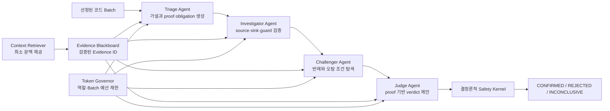

# AI 기반 Multi-Agent SAST 설계 보고서
이름: 이재우
## 1. Agent 구성도와 Skill 작성 시 주안점

설계한 SAST의 Agent는 자유롭게 대화하는 LLM 인스턴스가 아니라, 역할별
prompt·입력·출력 schema·권한·종료 조건을 가진 검증 가능한 프로그램
구성요소다. 분석 순서는 `Triage → Investigator → Challenger → Judge`로
고정하며 Orchestrator가 실행과 상태 전이를 관리한다.



| Agent | 담당 역할 | 허용 입력 | 출력과 종료 조건 |
|---|---|---|---|
| Triage | 위험 후보의 우선순위를 정하고 단일 취약점 가설 생성 | Security Sketch, risk tag, Evidence ID | `FINDING` 또는 `REQUEST_CONTEXT`; proof obligation 생성 후 종료하며 최종 판정 권한 없음 |
| Investigator | source·sink·guard와 proof 상태 검증 | Finding, proof packet, 검증된 Evidence | `EVIDENCE` 또는 `REQUEST_CONTEXT`; proof 갱신 또는 문맥 요청 한도에서 종료 |
| Challenger | 독립적으로 반례와 오탐 조건 탐색 | Finding, Evidence 요약, proof table | `CONTRADICTION` 또는 `REQUEST_CONTEXT`; 한정된 반례 탐색 후 종료 |
| Judge | 검증된 proof를 바탕으로 verdict 제안 | Finding, contradiction, proof table, 예산 상태 | 한 번의 verdict 후 종료; 프로그램의 결정론적 규칙이 최종 판정 강제 |

### Skill 작성 시 주안점

1. **역할과 권한 분리**
   가설 생성, 증거 검증, 반례 탐색, 판정을 서로 다른 Agent에 맡겼다.
   Triage·Investigator·Challenger는 최종 verdict를 낼 수 없다.

2. **독립 context와 hidden reasoning 비공유**
   Agent는 앞 Agent의 내부 추론을 전달받지 않고 구조화된 결과와 Evidence
   ID만 받는다. 앞선 판단에 그대로 동조하는 편향을 줄이기 위한 설계다.

3. **구조형 통신**
   Agent 간 메시지는 `FINDING`, `EVIDENCE`, `REQUEST_CONTEXT`,
   `CONTRADICTION`으로 제한한다. Pydantic domain schema와 Gemini Wire
   Schema로 허용되지 않은 필드와 자유 형식 원문을 거부한다.

4. **검증 가능한 Evidence 강제**
   Evidence를 사용할 때 TargetCode의 상대 경로, 행·byte 범위와 content
   hash를 다시 확인한다. 검증되지 않은 Evidence로 proof를 `SUPPORTED`로
   바꿀 수 없다.

5. **명시적인 종료 조건과 실패 폐쇄**
   모든 Agent는 호출과 문맥 요청 한도 안에서 종료한다. 선행 Agent가
   실패해도 후속 Agent는 UNKNOWN proof packet으로 실행되며, 미확인 proof나
   예산 소진이 남으면 `SAFE`로 단정하지 않고 `INCONCLUSIVE`로 종료한다.

6. **LLM과 최종 결정권 분리**
   Judge의 응답을 그대로 신뢰하지 않는다. 모든 필수 proof가 `SUPPORTED`이고
   `REFUTED`가 없을 때만 `CONFIRMED`, 필수 proof가 `REFUTED`이면 `REJECTED`,
   하나라도 `UNKNOWN`이면 `INCONCLUSIVE`로 확정하는 safety kernel을
   프로그램에 구현했다.

## 2. 토큰 절약을 위해 도입한 설계와 도입 이유

토큰 절약의 핵심은 저가 모델만 선택하는 것이 아니라, **보안 판단에 필요하지
않은 코드를 LLM에 보내지 않고 같은 원문을 Agent마다 반복 전송하지 않는
것**이다.

| 도입 설계 | 도입 이유 | 적용 방식 |
|---|---|---|
| 함수 중심 Semantic Chunk | 저장소 또는 파일 전체를 보내지 않고 의미 단위를 보존하기 위해 | 함수를 기본 단위로 만들고 대형 함수만 안전한 경계에서 분할 |
| 위험도·다양성 기반 Batch 선정 | 적은 호출로 서로 다른 고위험 영역을 대표하기 위해 | 분석 결과를 보기 전에 520개 후보 중 3개 Batch 고정 |
| 위험도 기반 최소 문맥 검색 | 처음부터 caller·callee·타입 정의 전체를 보내는 낭비를 막기 위해 | Investigator 등의 `REQUEST_CONTEXT`가 있을 때 필요한 Chunk만 검증 후 제공 |
| Evidence ID 기반 Blackboard | Agent마다 동일 코드 원문을 반복 전송하지 않기 위해 | Agent 간에는 Evidence ID, 범위, hash와 구조형 요약만 공유 |
| source-free Judge | 최종 판정에는 코드 전체보다 검증된 proof 상태가 중요하기 때문에 | Judge에는 Finding, contradiction, proof table과 예산 상태만 전달 |
| Token Governor | 문맥 요청과 출력이 무제한 증가하는 것을 막기 위해 | Agent별 입력·출력, 요청 횟수와 Batch 전체 예산을 제한 |
| Content Hash Cache | 동일 입력의 재분석에서 API 호출을 생략하기 위해 | provider·model·prompt·schema version과 context hash를 cache key로 사용 |
| 얕은 Gemini Wire Schema | 복잡한 JSON Schema 자체가 차지하는 입력 토큰을 줄이기 위해 | LLM은 의미 필드만 생성하고 ID는 host가 결정론적으로 생성 |
| 역할별 reasoning 제한 | 구조형 변환 중심 역할에서 불필요한 thinking token을 막기 위해 | 역할에 필요한 수준만 설정하고 최종 실행에서는 reasoning token 0 기록 |

### 실제 적용 효과

| 측정 항목 | 결과 |
|---|---:|
| Agent/API 호출 | 12회 |
| 재시도 | 0회 |
| Provider input/output tokens | 32,148 / 1,181 |
| Thinking/cached tokens | 0 / 0 |
| 실제 전송 source lexical estimate | 7,887 |
| 전체 저장소를 네 Agent에 반복 전송하는 source baseline | 2,750,876 |
| 선정 코드만 네 Agent에 반복 전송하는 source baseline | 14,852 |
| 전체 저장소 source baseline 대비 절감률 | **98.8314%** |
| 선정 코드 source baseline 대비 절감률 | **46.896%** |

Provider input token에는 prompt와 JSON Schema가 포함되므로 source lexical
estimate와 같은 지표로 해석하지 않았다. 첫 실제 실행은 새로운 context여서
cache hit이 없었으며, 측정된 절감은 코드 분할·최소 문맥 검색·Evidence 공유와
source-free Judge에서 발생했다.

## 3. 구현 작성 시 요청한 Prompt

### 3.1 Multi-Agent 설계 요청 Prompt

아래는 Multi-Agent 구조를 구현할 때 사용한 요구사항을 제출용으로 정리한
prompt다.

```text
대형 C/C++ 저장소를 분석하는 Multi-Agent SAST 구조를 설계하고 구현하라.

분석 입력은 코드 분할과 결과 비의존 선정 과정을 거쳐 사전에 고정된 3개
Batch로 제한하고, Triage → Investigator → Challenger → Judge 순서로 모든
역할을 실행하라. 각 Agent는 별도 클래스, 역할별 prompt, 입력·출력 schema,
독립 context와 종료 조건을 가져야 하며 Orchestrator가 실행 순서와 상태
전이를 관리해야 한다.

Agent 사이에는 코드 원문과 자유 형식 대화를 반복 전달하지 말고 Evidence
Blackboard의 검증된 Evidence ID와 구조형 packet만 공유하라. 허용 메시지는
FINDING, EVIDENCE, REQUEST_CONTEXT, CONTRADICTION으로 제한하라.

Evidence를 등록하거나 사용하기 전에 TargetCode의 상대 파일 경로, 행 범위,
byte 범위와 content hash를 다시 검증하라. 불일치하는 Evidence는 거부하고
해당 proof obligation을 UNKNOWN으로 유지하라.

Context Retriever는 요청된 최소 코드 범위만 제공하고 Token Governor는
Agent별 입력·출력 예산, 추가 문맥 요청 횟수와 Batch 전체 예산을 제한하라.
Agent가 실패하더라도 후속 역할은 UNKNOWN proof packet을 받아 실행 기록을
남기고, 미확인 proof 또는 예산 소진이 있으면 안전하다고 단정하지 말고
INCONCLUSIVE로 종료하라.

Judge의 LLM 출력만으로 verdict를 확정하지 말고 다음 결정론적 규칙을
프로그램에서 다시 강제하라.
- 모든 필수 proof가 SUPPORTED이고 REFUTED가 없으면 CONFIRMED
- 필수 proof가 하나라도 REFUTED이면 REJECTED
- 필수 proof가 UNKNOWN이거나 예산이 소진되면 INCONCLUSIVE

로그에는 Agent, Batch, Evidence ID, 메시지 유형, prompt/schema version,
token usage와 상태 전이만 기록하고 API Key, prompt 본문, 코드 원문과
비밀정보는 저장하지 말라.

구조형 메시지 제한, Evidence 변조·범위 오류 거부, Token Governor 예산,
Agent 실행 순서, 세 verdict, 실패 후 후속 Agent 실행과 재실행 결정성을
네트워크 없는 단위·통합 테스트로 검증하라.
```

### 3.2 Agent별 실제 실행 Prompt

아래 원문은 실제 [`prompts/`](prompts/)의 `prompt-v1`과 동일하다.

#### Triage Agent

```text
You receive only a Security Sketch, risk tags, stable Evidence IDs, and a minimal CWE template.

Your authority is limited to prioritization and creation of a single hypothesis with explicit proof obligations. Output only `FINDING` or `REQUEST_CONTEXT` structured messages. Never emit SAFE, CONFIRMED, REJECTED, or a final vulnerability decision. Terminate after one bounded triage decision.
```

#### Investigator Agent

```text
You receive one prioritized finding, proof obligations, and Evidence IDs in an independent context. Build only an evidence-backed source/sink/guard argument. Request missing code only through `REQUEST_CONTEXT`; never copy source text into inter-agent messages. `SUPPORTED` requires a registered Evidence ID. Do not produce a final verdict. Terminate when all obligations are updated or a bounded context request cannot resolve uncertainty.
```

#### Challenger Agent

```text
Independently search the provided Evidence IDs and proof table for a sanitizer, bound check, unreachable path, build exclusion, safe wrapper, or other counterexample. Output only `CONTRADICTION` or `REQUEST_CONTEXT` structured messages. Do not inherit Investigator hidden reasoning and do not issue a final verdict. Terminate after the bounded contradiction pass.
```

#### Judge Agent

```text
Receive only the finding, registered Evidence IDs, contradiction messages, proof obligations, and budget state. Never use hidden reasoning from another agent. Return CONFIRMED only when every required obligation is SUPPORTED and none is REFUTED. Return REJECTED when a required obligation is REFUTED. Return INCONCLUSIVE when any required obligation is UNKNOWN or context/budget is exhausted. Terminate after one verdict.
```

## 4. 납품 도구로서의 차별점

REFINE-SAST를 고객에게 납품하는 관점에서 가장 큰 차이는 “LLM이 취약하다고
말한 결과”만 제공하는 것이 아니라, **왜 그 판정이 나왔는지 추적하고 다시
검증할 수 있는 분석 과정과 근거**를 함께 제공한다는 점이다.

| 비교 항목 | 일반적인 단일 LLM 코드 리뷰 | REFINE-SAST |
|---|---|---|
| 대형 저장소 처리 | 파일 전체 또는 사용자가 선택한 일부 코드 입력 | 저장소 스캔, 함수 중심 분할, 위험도·다양성 기반 Batch 선정 자동화 |
| 분석 역할 | 하나의 모델이 가설·검증·판정을 모두 수행 | Triage·Investigator·Challenger·Judge로 책임과 권한 분리 |
| 근거 관리 | 자연어 설명이나 코드 인용에 의존 | 경로·행·byte·hash가 검증된 Evidence ID로 추적 |
| 오탐 억제 | 최초 분석 결론을 그대로 수용하기 쉬움 | 독립 Challenger가 sanitizer·bound check·도달성 등 반례 탐색 |
| 최종 판정 | LLM의 확신도와 문장에 의존 | proof obligation safety kernel이 verdict를 결정론적으로 제한 |
| 실패 처리 | 오류 후 중단하거나 불완전 결과를 정상처럼 반환할 수 있음 | 후속 Agent를 UNKNOWN packet으로 실행하고 `INCONCLUSIVE`로 안전 종료 |
| 비용 통제 | 동일 원문 반복 전송, 호출 비용 예측이 어려움 | 최소 문맥, Evidence 공유, source-free Judge, Token Governor, Cache 적용 |
| 감사·재현 | prompt와 세션 상태에 따라 결과 추적이 어려움 | 안정적 ID, content hash, version, event log와 token ledger 제공 |
| Provider 종속성 | 특정 API에 강하게 결합 | 공통 Provider 인터페이스로 Gemini·Local LLM·Mock·선택적 OpenAI 경로 분리 |

### 핵심 차별 요소

1. **Result-blind diversity selection**
   분석 결과가 잘 나온 코드를 사후 선택하지 않고 첫 LLM 호출 전에 위험도와
   다양성으로 대상을 고정해 평가와 납품 결과의 신뢰성을 높인다.

2. **Evidence Blackboard**
   Agent 대화를 자유 형식 원문 교환이 아닌 검증 가능한 Evidence graph로
   바꿔 결과에서 실제 코드 위치까지 추적할 수 있다.

3. **Proof-obligation Judge**
   LLM의 자신감이 아니라 공격자 제어, 위험 연산 도달성, 방어 조건 등 필요한
   증명 항목의 상태로 판정을 제한한다.

4. **Host-generated identity**
   Finding·Message·Evidence·Proof ID를 모델이 임의 생성하지 않고 검증된
   입력을 이용해 프로그램이 결정론적으로 생성하여 참조 환각을 줄인다.

5. **Fail-safe full chain**
   선행 Agent가 실패해도 Challenger와 Judge를 생략하지 않는다. 불완전한
   분석은 취약점 없음으로 포장하지 않고 `INCONCLUSIVE`로 명시한다.

6. **측정 가능한 토큰 절감**
   단순히 “저비용 모델을 사용했다”고 주장하지 않고, 전체 저장소·선정 코드
   baseline과 실제 source 전송량을 분리해 절감 효과를 수치로 제시한다.
